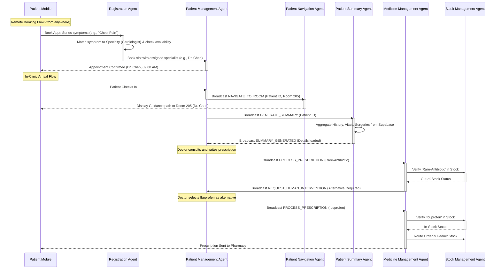

# M.A.S.H AI Agent Ecosystem

This document describes the 6 specialized AI agents running within the M.A.S.H (Medical Assistant & Services Hub) ecosystem. By splitting medical clinic workflows into modular, single-responsibility agents coordinated by the `BandSDK`, the platform removes clinical friction, automates administrative handoffs, and improves patient throughput.

---

## 1. Registration Agent
* **Role**: Smart Clinical Matchmaker & Directory Coordinator
* **Responsibilities**:
  - Maintains a real-time index of active clinic clinicians, specialties, and schedules.
  - Analyzes the patient's symptoms/medical issues shared via the mobile chatbot.
  - Automatically matches and assigns the patient to the most suitable available specialist.
* **Events**:
  - **Subscribes**: `REQUEST_DOCTOR_MATCH`
  - **Publishes**: `DOCTOR_ASSIGNED`, `DOCTOR_DIRECTORY_UPDATED`
* **How it makes life easier**: Eliminates manual triage and scheduler bias. Patients are instantly assigned to the right care provider based on clinical need and schedule availability.

---

## 2. Patient Management Agent
* **Role**: Queue & Remote Booking Orchestrator
* **Responsibilities**:
  - Processes remote appointment bookings made by patients from anywhere.
  - Manages live queues for patients based on scheduled times and real-time check-ins.
  - Handles cancellations and rescheduling slots dynamically.
* **Events**:
  - **Subscribes**: `BOOK_APPOINTMENT`, `PATIENT_CHECK_IN`, `APPOINTMENT_COMPLETED`
  - **Publishes**: `QUEUE_UPDATED`, `RESCHEDULE_CONFIRMED`
* **How it makes life easier**: Automates schedule updates from remote and in-clinic patient interactions, keeping the clinic queue balanced.

---

## 3. Patient Navigation Agent
* **Role**: Wayfinding Assistant
* **Responsibilities**:
  - Monitors doctor room allocations.
  - Calculates and sends routing paths and room guidance to the patient's mobile app upon check-in.
* **Events**:
  - **Subscribes**: `PATIENT_CHECKED_IN`, `DOCTOR_ROOM_CHANGE`
  - **Publishes**: `NAVIGATE_TO_ROOM`
* **How it makes life easier**: Guides patients directly to their doctor's door (e.g., "Room 101"), eliminating clinic navigation anxiety and lobby clutter.

---

## 4. Patient Summary Agent
* **Role**: Clinical Record Aggregator
* **Responsibilities**:
  - Queries historical patient records, lab tests, and past surgeries from Supabase.
  - Compiles an easy-to-read clinical summary on check-in.
* **Events**:
  - **Subscribes**: `GENERATE_SUMMARY` (patient checked in event)
  - **Publishes**: `SUMMARY_GENERATED`
* **How it makes life easier**: Saves clinicians hours of clicking through tabs in traditional EHR software by presenting a consolidated case brief upon check-in.

---

## 5. Medicine/Prescription Management Agent
* **Role**: Prescription Safety & Order Auditor
* **Responsibilities**:
  - Intercepts written clinical prescriptions.
  - Cross-references inventory stock levels with the Stock Management Agent.
  - Dispatches orders to pharmacy or handles out-of-stock prompts.
* **Events**:
  - **Subscribes**: `PROCESS_PRESCRIPTION`
  - **Publishes**: `ROUTE_TO_PHARMACY`, `REQUEST_HUMAN_INTERVENTION`
* **How it makes life easier**: Ensures doctors are alerted immediately if a drug is out of stock, prompting alternatives before the patient departs for the pharmacy.

---

## 6. Stock Management Agent
* **Role**: Inventory & Logistics Controller
* **Responsibilities**:
  - Monitors real-time stock levels of the clinic's medicine inventory.
  - Identifies patterns of high-frequency stock usage to suggest proactive reorders.
* **Events**:
  - **Subscribes**: `ROUTE_TO_PHARMACY` (to deduct stock)
  - **Publishes**: `TRIGGER_REORDER`, `STOCK_ALERTS_UPDATED`
* **How it makes life easier**: Automatically alerts pharmacists of low stock and flags repeating items for batch ordering, preventing critical drug shortages.

---

## Agent Handoff Interaction Flow

Below is a sequential flow showing how these agents collaborate asynchronously for a patient visit, starting from a remote symptom-based booking:

