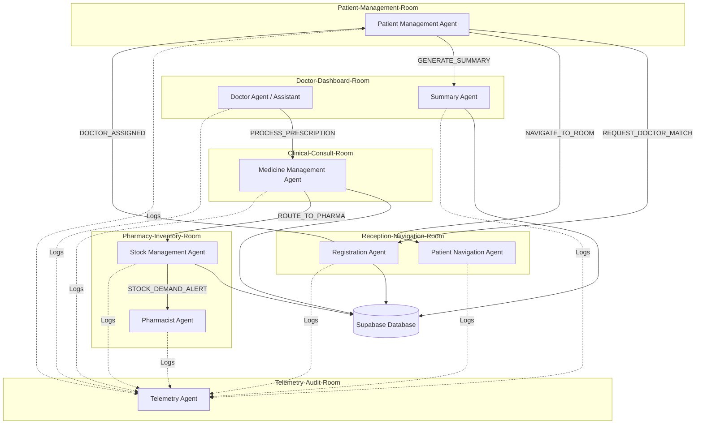
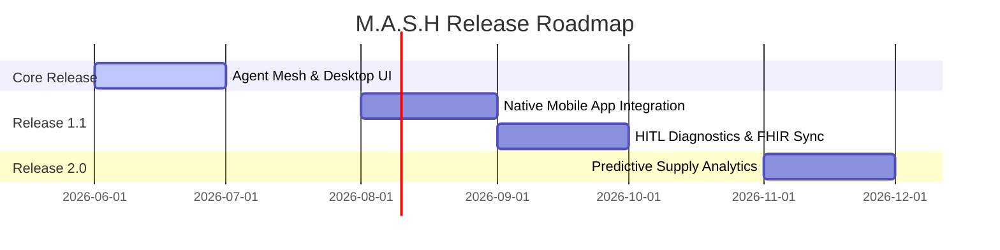

# Product Requirements Document (PRD)
## M.A.S.H: Medical Assistant & Services Hub

---

### 1. Document Metadata
* **Project Name**: M.A.S.H (Medical Assistant & Services Hub)
* **Status**: Compiled / Approved
* **Author**: Antigravity (AI Coding Assistant)
* **Date**: June 29, 2026
* **Version**: 1.0.0
* **Target Audience**: Development Team, Product Managers, Clinical Stakeholders

---

### 2. Introduction & Vision

#### 2.1 Problem Statement
Modern healthcare facilities are bogged down by administrative overhead, manual scheduling bias, and fragmented Electronic Health Record (EHR) systems. Doctors spend a significant portion of their shifts clicking through tabs to compile patient history. Pharmacists struggle with inventory management, causing delays when prescribed medications are out of stock. Patients face clinic navigation anxiety, scheduling delays, and jargon-heavy communication.

#### 2.2 Product Vision
M.A.S.H is a decentralized healthcare orchestration platform designed to automate clinical workflows and remove patient administrative friction. By utilizing a multi-agent AI system operating across a secure, segmented virtual network, M.A.S.H coordinates clinic registration, doctor matching, navigation, clinical summary compilation, stock-level audits, and reorder alerts. It presents this intelligence via a minimal, premium, jargon-free desktop dashboard for clinical staff and a concept mobile client for patients.

#### 2.3 Key Objectives
* **Reduce Administrative Load**: Automate handoffs between booking, triage, consulting, and dispensing.
* **Clinician Efficiency**: Present consolidated clinical summaries to physicians upon patient check-in, bypassing traditional EHR click-heavy navigation.
* **Proactive Inventory Control**: Prevent prescription fulfillment delays by checking stock in real-time and offering instant human-in-the-loop (HITL) alternatives when drugs are unavailable.
* **Wayfinding Guidance**: Guide patients directly to their assigned consultation rooms, decreasing lobby crowding.
* **Auditability & Compliance**: Centralize all room-level interactions, state changes, and human approvals into a read-only telemetry audit trail.

---

### 3. Scope & Boundaries

#### 3.1 In-Scope (Core Release)
1. **AI Agent Mesh**: 6+ specialized AI agents built on the `BandSDK` communicating via P2P virtual rooms.
2. **Clinical Desktop Dashboard**: A TypeScript/Vite single-page application (SPA) displaying schedule queues, patient profiles, active prescriptions, pharmacy stock levels, and telemetry reports.
3. **Database Integration**: Supabase (PostgreSQL) backend managing clinic directories, patient profiles, appointments, prescription logs, and inventory data.
4. **Symptom-to-Clinician Matching**: Rule-based and LLM-assisted classification mapping symptoms to Cardiology, Pediatrics, or General Practice.
5. **Human-in-the-Loop (HITL) Workflows**: Desktop interface prompts for alternative drug selection if a prescription is out of stock.
6. **Telemetry & Auditing**: Automatic logging of agent actions and state modifications to a telemetry viewer.

#### 3.2 Out-of-Scope (Future Releases)
* **Native Mobile Applications**: The patient mobile application is currently represented as a chatbot interface concept (integrated via client simulations).
* **Direct EHR/EMR Integration**: Native integrations with Epic, Cerner, or other legacy systems (handled via Supabase mocks for this release).
* **Direct IoT Wayfinding**: Indoor GPS/Beacon hardware integration (represented via step-by-step text directions).

---

### 4. User Personas & Journeys

| Persona | Role | Primary Goal | Paint Point Solved by M.A.S.H |
| :--- | :--- | :--- | :--- |
| **Dr. Elena Chen** | Cardiologist / Clinician | Provide efficient patient care and consults. | Doesn't have to search through legacy EHR tabs; receives a concise summary instantly. |
| **Patient John Doe** | Clinic Patient | Book appointments, get diagnosed, and receive medicine without delays. | Chatbot symptom matching assigns correct specialist; wayfinding guides him; out-of-stock medications are resolved before reaching pharmacy. |
| **Sarah Jenkins** | Clinic Pharmacist | Dispense prescriptions and maintain medicine inventory. | Receives preparation alerts immediately; stock levels update automatically; high-demand alerts prevent stockouts. |
| **System Auditor** | Compliance Officer | Ensure all clinical activities and drug changes are logged. | Telemetry dashboard tracks every agent lifecycle step and human intervention. |

---

### 5. Multi-Agent System Architecture

The core of M.A.S.H relies on the **Band of Agents SDK (BandSDK)**. Agents are isolated processes that communicate asynchronously by publishing and subscribing to specific events inside secure virtual rooms.

#### 5.1 Communication Network Segmentation (Rooms)
To guarantee network efficiency and compliance, the P2P event bus is segmented into six distinct rooms:
1. **`Patient-Management-Room`**: Handles patient booking, rescheduling, and status updates.
2. **`Doctor-Dashboard-Room`**: Connects doctors to their virtual assistants for summary lookups and dashboard notifications.
3. **`Clinical-Consult-Room`**: Manages clinical-facing activities (e.g., summary generation requests, safety validations).
4. **`Pharmacy-Inventory-Room`**: Manages stock-checking, routing orders, and inventory audits.
5. **`Reception-Navigation-Room`**: Manages wayfinding pathways and initial check-ins.
6. **`Telemetry-Audit-Room`**: Collects immutable logs of agent statuses, state modifications, and HITL approvals.

---

### 6. Functional & Agent Requirements

#### 6.1 Patient Booking & Symptom Triage
* **Initiator**: Patient Mobile Concept
* **Coordinator Agent**: `PatientManagementAgent`
* **Worker Agent**: `RegistrationAgent`
* **Workflow**:
  1. Patient describes symptoms (e.g., *"My chest is tight and my heart is beating fast"*).
  2. `PatientManagementAgent` maps the text and broadcasts `REQUEST_DOCTOR_MATCH` with a unique `requestId`.
  3. `RegistrationAgent` parses symptoms using a triage classifier:
     * Keyword match (`chest pain`, `heart`, `cardio`) $\rightarrow$ **Cardiology**.
     * Keyword match (`fever`, `child`, `pediatric`) $\rightarrow$ **Pediatrics**.
     * Else $\rightarrow$ **General Practice**.
  4. `RegistrationAgent` queries Supabase for available specialist doctors matching the classified specialty and broadcasts `DOCTOR_ASSIGNED`.
  5. `PatientManagementAgent` resolves the pending future using the `requestId` and confirms the booking.

#### 6.2 Patient Wayfinding & Navigation
* **Initiator**: Patient Mobile Check-In
* **Worker Agent**: `PatientNavigationAgent`
* **Workflow**:
  1. Upon patient check-in at the clinic lobby, the app broadcasts `NAVIGATE_TO_ROOM`.
  2. `PatientNavigationAgent` checks the clinician's allocated room and floor (e.g., `doc-1` is in `Room 302, 3rd Floor`).
  3. The agent compiles step-by-step directions: *"From Lobby Entrance: Go to the elevator, go to the 3rd Floor, and find Room 302."*
  4. The agent publishes `NAVIGATION_DIRECTIONS` to output this path to the patient's device.
  5. Relocation triggers: If a doctor changes offices, a `DOCTOR_ROOM_CHANGE` event is broadcasted to update the navigation routing mapping.

#### 6.3 Clinical Summary Compilation
* **Initiator**: Doctor Dashboard / Check-In Event
* **Worker Agent**: `SummaryAgent`
* **Workflow**:
  1. On patient check-in, the system broadcasts `SUMMARIZE_PATIENT_HISTORY`.
  2. `SummaryAgent` queries Supabase for records associated with `patient_id` across chronic conditions, allergies, surgical histories, and lab tests.
  3. The agent formats the payload into a structured context and calls the LLM (`gemini-3.1-flash-lite`) to compile a concise markdown clinical summary.
  4. The agent saves the compiled summary to Supabase and broadcasts `PATIENT_HISTORY_COMPILED` to update the doctor's dashboard in real-time.

#### 6.4 Prescription Validation & Stock Check
* **Initiator**: Clinician Consultation (Prescription Entry)
* **Worker Agents**: `MedicineManagementAgent` & `StockManagementAgent`
* **Workflow**:
  1. Doctor submits a prescription (e.g., *Amoxicillin 500mg*).
  2. `MedicineManagementAgent` intercepts the request and queries Supabase to check the drug's `current_stock`.
  3. **Case A: In Stock**:
     * Agent broadcasts `PREPARE_MEDICINE` to the pharmacist dashboard.
     * Agent triggers stock deduction via `ROUTE_TO_PHARMA` to `StockManagementAgent`.
     * `StockManagementAgent` decrements the stock count in Supabase. If the usage count for a drug reaches a threshold ($\ge 2$ requests per shift), it triggers a `STOCK_DEMAND_ALERT` to suggest proactive restocking.
  4. **Case B: Out of Stock**:
     * Agent publishes `ALTERNATIVE_MEDICINE_REQUESTED`.
     * The process enters a Human-in-the-Loop (HITL) state. The doctor's dashboard highlights a shortage alert.
     * The doctor selects an alternative medication (e.g., *Ibuprofen*).
     * The script re-runs the stock validation loop. Once approved, `PRESCRIPTION_SAFETY_PASSED` is published, and the pharmacist is notified.

#### 6.5 Telemetry & Audit Trail
* **Worker Agent**: `TelemetryAgent`
* **Workflow**:
  1. All agents are required to broadcast lifecycle updates (`AGENT_JOINED`), state changes (`STATE_UPDATED`), and intervention requests (`HUMAN_INTERVENTION_REQUESTED`) to the secure `Telemetry-Audit-Room`.
  2. `TelemetryAgent` listens continuously, compiling a linear timeline log.
  3. Upon request or shutdown, `TelemetryAgent` prints the audit trail or feeds the telemetry table on the Desktop Frontend.

---

### 7. Interface Requirements

#### 7.1 Desktop Frontend Views (Vite, TS, Vanilla CSS)
The desktop frontend is a responsive WebApp implementing modern, high-fidelity design standards (vibrant dark slate palettes, clear card layout, and smooth UI animations):
1. **Auth View**: Login page utilizing Supabase Auth or local developer simulation bypass.
2. **Dashboard View**: Main command center showing today's patient queue, active notifications, pending alternative medicine overrides, and global stock alert counters.
3. **Schedule View**: Calendar queue displaying doctor slots and booking allocations.
4. **Patients List & Profiles**: Master directory of registered patients containing photos, demographics, and clinical timelines.
5. **Prescriptions View**: Dedicated pane for doctors to issue and monitor active prescriptions and their safety statuses.
6. **Pharmacy View**: Workspace for pharmacists displaying pending medicine prep cards, inventory counters, and low-stock indicators with interactive restock controls.
7. **Telemetry View**: A real-time data table listing system-wide event logs.

#### 7.2 Patient Mobile Concept
* Chatbot-style UI showing symptom inputs, confirmation of mapped appointment slots, wayfinding instructions, and pickup notifications from the pharmacy.

---

### 8. Technical Specifications & Dependencies

#### 8.1 Backend & Middleware
* **API Server**: Express.js with TypeScript (`Backend/src/index.ts`). Exposes endpoints for schedules, patient metrics, pharmacy transactions, and manual overrides.
* **Agent Engine**: Python 3.10+ containing the `BandSDK` runtimes (`Agents/agent_server.py`).
* **State Machine**: LangGraph used to build static DAGs (Directed Acyclic Graphs) for clinical safety checks.
* **Async Orchestration**: `asyncio` loop running in Python, mapping asynchronous request tokens (`requestId` UUIDs) to resolve awaiting promises.

#### 8.2 Database Schema (Supabase / Postgres)
* **`profiles`**: Patient details (UUID, name, dob, phone, allergy details, surgical history).
* **`doctors`**: Clinician roster (UUID, name, specialty, room_number, floor).
* **`appointments`**: Bookings (UUID, patient_id, doctor_id, slot_time, status: `scheduled`, `checked_in`, `completed`).
* **`medicine_inventory`**: Stock metrics (UUID, medicine_name, current_stock, reorder_threshold, usage_count).
* **`prescriptions`**: Master records (UUID, patient_id, doctor_id, status: `pending`, `alternative_requested`, `fulfilled`).
* **`prescription_items`**: Individual line items (UUID, prescription_id, medicine_id, dosage, frequency, duration).
* **`telemetry_logs`**: System audit records (UUID, timestamp, room, action, log_message).

---

### 9. Non-Functional Requirements (NFRs)

* **Security & HIPAA-Alignment**:
  * Implement PostgreSQL Row Level Security (RLS) policies in Supabase.
  * Encrypt patient details at rest.
  * Require token-based authorization for all API requests.
* **Reliability & Timeout Handling**:
  * Set a strict 10-second timeout (`asyncio.wait_for`) on all agent P2P proxy operations. If a service goes offline, the calling LLM must receive a structured timeout error to reply gracefully.
* **Design & Usability**:
  * Consistent layout using a premium CSS design system (Inter font, smooth gradients, subtle hover micro-animations).
  * High-contrast styling for readability in active clinical settings.

---

### 10. Future Roadmap

1. **Release 1.1**:
   * Deploy native iOS and Android patient applications using React Native.
   * Standardize database schemas to align with the HL7 FHIR (Fast Healthcare Interoperability Resources) data models.
2. **Release 2.0**:
   * Implement predictive machine learning models to forecast medicine stockouts based on seasonal illness metrics.
   * Integrate live video consultations directly into the `Clinical-Consult-Room`.
