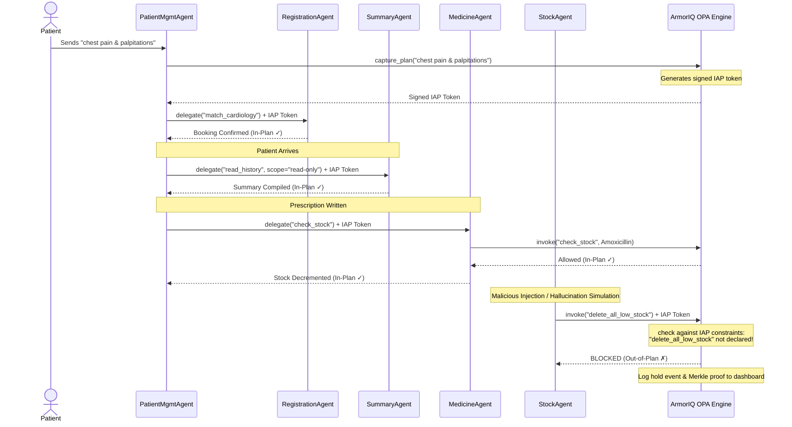

# Product Requirements Document (PRD)
## M.A.S.H: ArmorIQ Cryptographic Agent Guardrails & Audit System

---

### 1. Document Metadata
* **Project Name**: M.A.S.H - ArmorIQ Integration Layer
* **Status**: Proposed / Design Specification
* **Author**: Antigravity (AI Coding Assistant)
* **Date**: June 29, 2026
* **Version**: 1.0.0
* **Target Audience**: Core Engineers, Security Architects, Compliance Officers

---

### 2. Executive Summary & Vision

#### 2.1 Context & Problem Statement
In healthcare systems governed by autonomous AI agents, an agent acting outside its scope is not just a software bug—it is a legal and safety liability. If a sub-agent executes unauthorized database operations, leaks patient charts, or bypasses inventory safety checks due to prompt injections or logic flaws, the consequences are critical. Current LLM frameworks lack deterministic, cryptographic guarantees that tool calls match the original user intent.

#### 2.2 Product Vision
The **ArmorIQ Layer** for M.A.S.H introduces a zero-trust cryptographic guardrail system. Every patient interaction creates a signed **Intent Assurance Plan (IAP)**. All downstream agent delegations and tool executions must present cryptographic proof of authorization matching this plan. Any out-of-scope tool call is caught, held, and flagged in real-time, backed by a Merkle-proofed audit log.

```
[Patient Symptom Intent] 
         │
         ▼
 1. capture_plan() ──► [Signed Intent Assurance Plan (IAP)]
         │
         ▼
 2. delegate()     ──► [Scoped Sub-Agent Session Token]
         │
         ▼
 3. invoke()       ──► [Verification vs. Signed Plan] ──► [OPA Engine]
         │                                                      │
         ├─► In-Plan  ──► [Execute Tool]                        │
         └─► Out-of-Plan ──► [HOLD / BLOCK Decision] ◄──────────┘
                 │
                 ▼
 4. Audit Log      ──► [Merkle Proof Registry]
```

---

### 3. Core Functional Requirements

#### 3.1 Plan Capture (`capture_plan`)
* **Requirement**: The system must extract the patient's initial request and compile it into a structured, signed Intent Assurance Plan (IAP) before triggering any downstream events.
* **Details**:
  * On patient intake/chatbot interaction, `PatientManagementAgent` intercepts the natural language symptoms.
  * Calls `capture_plan(patient_intent)` to generate an IAP listing authorized operations (e.g., matching doctor, calculating navigation, pulling past medical records, stock check for written prescription).
  * Cryptographically signs the IAP using a system private key.

#### 3.2 Scoped Delegation (`delegate`)
* **Requirement**: When the orchestrator agent broadcasts events or delegates work to sub-agents, it must attach a scoped delegation token.
* **Details**:
  * An agent can only delegate actions that are subset to its own active IAP.
  * *Example*: `PatientManagementAgent` delegates to `SummaryAgent` using `delegate(summary_agent_id, scope=['read_medical_records'])`. The `SummaryAgent` cannot perform write operations or stock deletions because they are not present in its delegation token scope.

#### 3.3 Dynamic Validation & Guardrails (`invoke`)
* **Requirement**: Before any agent executes a tool call that modifies state or retrieves sensitive data, the `ArmorIQ` middleware must intercept and validate the action.
* **Details**:
  * Validation matches the tool parameters against the signed IAP.
  * **In-Plan Actions**: Executed immediately.
  * **Out-of-Plan Actions**: Placed on `HOLD` or `BLOCKED`. The event is pushed to the ArmorIQ Security Dashboard for human review (Approve/Reject).

#### 3.4 Cryptographically Auditable Log
* **Requirement**: Every allow, block, or hold decision must be recorded with a Merkle proof to ensure log integrity.
* **Details**:
  * Decisions are hashed and appended to a tamper-proof database log.
  * The ledger supports verification checking: users can verify any audit entry via a Merkle path proof on the ArmorIQ Dashboard.

---

### 4. Detailed Agent Security Scopes

To implement zero-trust, we define precise maximum scopes for each of the 6 core agents:

| Agent | Permitted Tools / Actions | Prohibited / Out-of-Scope Actions |
| :--- | :--- | :--- |
| **01. Registration Agent** | `query_doctor_directory`, `insert_appointment` | `modify_medical_records`, `adjust_stock` |
| **02. Patient Mgmt Agent** | `capture_plan`, `delegate`, `update_queue` | `direct_db_writes`, `bypass_safety_checks` |
| **03. Navigation Agent** | `read_room_allocations`, `calculate_path` | `query_patient_records`, `write_prescriptions` |
| **04. Summary Agent** | `read_medical_records` (subset: specific `patient_id`) | `delete_records`, `write_prescriptions` |
| **05. Medicine Mgmt Agent** | `query_medicine_stock`, `verify_dosage` | `delete_stock`, `update_doctor_schedules` |
| **06. Stock Mgmt Agent** | `decrement_stock`, `trigger_reorder` | `delete_all_low_stock` (destructive actions) |

---

### 5. Architectural & Tech Stack Integration

The addition of the ArmorIQ layer maps across the three primary system tiers:

```
┌─────────────────────────────────────────────────────────────┐
│                       FRONTEND LAYER                        │
│ - React + Vite Desktop dashboards for Doctors & Pharmacists  │
│ - ArmorIQ Policy Dashboard (Merkle Proofs, Logs, and Holds)  │
│ - Socket.IO real-time event streaming                       │
└──────────────▲──────────────────────────────▲───────────────┘
               │                              │
┌──────────────▼──────────────────────────────▼───────────────┐
│                       BACKEND LAYER                         │
│ - Express.js REST API Server (TypeScript)                    │
│ - Supabase (PostgreSQL with Row Level Security - RLS)       │
│ - Python asyncio (Non-blocking proxy tool bridge)           │
└──────────────▲──────────────────────────────▲───────────────┘
               │                              │
┌──────────────▼──────────────────────────────▼───────────────┐
│                        AGENT LAYER                          │
│ - ArmorIQ SDK (capture_plan, delegate, invoke)              │
│ - Open Policy Agent (OPA) Engine (Rego Policies)            │
│ - BandSDK Multi-Room P2P Event Bus                          │
│ - LangGraph + Gemini 1.5 Flash                              │
└─────────────────────────────────────────────────────────────┘
```

#### 5.1 Open Policy Agent (OPA) Integration
* The ArmorIQ Layer embeds an **OPA Engine** compiled to WebAssembly or running alongside the Python agent processes.
* Policies are written in `Rego` to declare structural rules, such as:
  ```rego
  package play.mash.authz

  default allow = false

  # Rule: Summary Agent can only read medical records
  allow {
      input.agent == "SummaryAgent"
      input.action == "read"
      input.resource == "medical_records"
  }
  ```

---

### 6. Demo Script Scenario: Blocked Destructive Action

To demonstrate the efficacy of the cryptographic guardrails, a simulated attack script must run upon system testing:



1. **Step 1 (In-Plan)**: Patient books with symptoms. `PatientMgmtAgent` initiates `capture_plan()`. IAP is signed. `RegistrationAgent` successfully maps the patient to Cardiology.
2. **Step 2 (In-Plan)**: Patient checked in. `NavigationAgent` issues room directions. `SummaryAgent` compiles past history with a strictly delegated read-only token on the patient's records.
3. **Step 3 (In-Plan)**: Doctor writes prescription. `MedicineManagementAgent` checks stock. `invoke()` verifies the stock audit matches the intent, and logs a decrement.
4. **Step 4 (Blocked Action)**: `StockManagementAgent` executes a command to `delete_all_low_stock` (simulating a prompt injection or bug). Since this destructive command is not in the signed IAP, `ArmorIQ` catches the call, **blocks execution**, places it on hold, and issues a Merkle proof log to the security dashboard.

---

### 7. Key Data Schemas & API Endpoints

#### 7.1 Data Schemas

##### `IntentAssurancePlan` (IAP) JSON
```json
{
  "iap_id": "iap_7b89c3d4-ea12-4eb1-902f-b44c8df81512",
  "patient_id": "p_89d311cb-0a2d-44aa-9cbf-7dfa91b248a3",
  "intent_hash": "e3b0c44298fc1c149afbf4c8996fb92427ae41e4649b934ca495991b7852b855",
  "authorized_scopes": [
    "patient.registration",
    "patient.navigation",
    "clinical.history.read",
    "prescription.validate",
    "inventory.stock.decrement"
  ],
  "signature": "MEQCIDU9wFwZ1i..."
}
```

##### `AuditLogEntry` JSON
```json
{
  "log_id": "audit_99bbcc22-3c2b-4da1-b921-e34d88fc1501",
  "timestamp": "2026-06-29T10:54:00Z",
  "agent_id": "StockManagementAgent",
  "action": "delete_all_low_stock",
  "status": "BLOCKED",
  "reason": "Action 'delete_all_low_stock' not in authorized_scopes of IAP.",
  "merkle_root": "a4d32a90f1d072e9...",
  "merkle_proof": [
    "c89b91...",
    "e20bfa..."
  ]
}
```

#### 7.2 API Endpoints

* **`POST /api/security/plans`**
  * Generates and signs an Intent Assurance Plan from patient details.
* **`POST /api/security/verify`**
  * Verifies a sub-agent token and checks if a tool invocation matches the active policy.
* **`GET /api/security/audit-logs`**
  * Returns list of Merkle-proven logs.
* **`POST /api/security/override`**
  * Admin override to approve a held request.

---

### 8. Verification & QA Plan

* **Integration Tests**:
  * Execute `test_armoriq_compliance.py` to trigger the demo script.
  * Verify that all steps (1 to 3) execute with status `in-plan`.
  * Confirm that Step 4 (`delete_all_low_stock`) yields a `BlockedException` and registers on the ArmorIQ Dashboard with a verifiable Merkle Proof.
* **Cryptographic Verification**:
  * Build a test script `verify_merkle_trail.py` to pull logs, calculate the leaf hashes, and verify the cryptographic chain against the master root.
