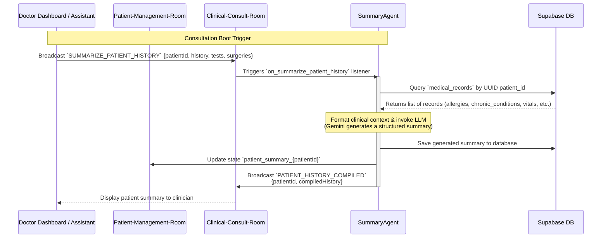

# Clinical Summary Compilation Workflow

This document explains the workflow for aggregating historical patient medical records from Supabase and compiling them into a concise clinical summary for the consulting clinician.

## Overview

When a patient checks in or a physician starts a consultation, the **Summary Agent** compiles the patient's case history. It queries the database for all historic records (vitals, allergies, surgeries, tests, and chronic conditions), cleanses the datasets, runs them through the LLM to format a structured briefing, saves the result, and alerts the doctor's assistant.

## Rooms and Agents Involved

- **Patient-Management-Room**: The room where arrival-time check-in updates triggers case brief compilation.
- **Clinical-Consult-Room**: Coordinates clinical checks and records transfers between the consultation desk and back-office agents.
- **Doctor-Dashboard-Room**: Conveys summary availability and notification alerts directly to the doctor's assistant.
- **SummaryAgent**: Queries Supabase, processes records, and invokes the LLM (`gemini-3.1-flash-lite`) to compile summaries.
- **DoctorAssistantAgent**: Receives notification updates and presents summary details conversationally to Dr. Smith.

## Detailed Event Sequence



## Data Aggregation Structure

The Summary Agent maps Supabase database records based on `record_type`:

| DB `record_type` | Extracted Fields |
| :--- | :--- |
| `chronic_condition` | String description |
| `allergy` | JSON parsing: name, severity |
| `test_result` | JSON parsing: name, date, result |
| `surgical_history` | JSON parsing: procedure, date, outcome |

## Key Events Schema

### `SUMMARIZE_PATIENT_HISTORY` (Incoming)
Requests compilation of records:
```json
{
  "patientId": "e1f13b19-c603-49d6-8486-ffc07e05f039",
  "history": [],
  "tests": [],
  "surgeries": []
}
```

### `PATIENT_HISTORY_COMPILED` (Outgoing)
Broadcats completed markdown summary back to the consultation room:
```json
{
  "patientId": "e1f13b19-c603-49d6-8486-ffc07e05f039",
  "compiledHistory": "### Patient Summary\n- **Allergies**: NKDA\n- **Chronic Conditions**: Mild Hypertension\n- **Recent Tests**: BP 130/85 (05/2026)\n- **Surgical History**: Appendectomy (2020) - fully recovered."
}
```
