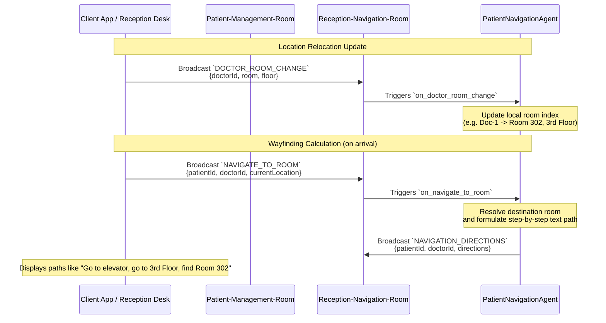

# Wayfinding & Patient Navigation Workflow

This document describes the wayfinding and path calculation workflow used to guide checked-in patients to their designated clinicians' consultation rooms.

## Overview

When patients check in at reception or arrive at the clinic, the **Patient Navigation Agent** calculates real-time step-by-step directions to their assigned doctor's room. If a doctor relocates to a different office, the agent updates its location dictionary so that subsequent directions remain accurate.

## Rooms and Agents Involved

- **Patient-Management-Room**: Used to relay in-clinic wayfinding directions requested during general queue actions.
- **Reception-Navigation-Room**: Channels arrival-time check-in routing messages directly to the reception dashboard/client interface.
- **PatientNavigationAgent**: Manages doctor room mappings and processes coordinates/directions.

## Detailed Event Sequence



## Directions Resolution Logic

The Patient Navigation Agent maintains a structured index of clinical staff room numbers. It compiles text directions using a location lookup helper:

- **Seeded Doctor Coordinates**:
  - `doc-1` (Dr. Smith): Room 302, 3rd Floor
  - `doc-2` (Dr. Jones): Room 105, 1st Floor
  - `doc-3` (Dr. Davis): Room 204, 2nd Floor
- **Directions Compilation**:
  - *Identified Location*: `"From {current_location}: Go to the elevator, go to the {floor}, and find {room}."`
  - *Fallback Location*: `"From {current_location}: Please head to the main information desk on the ground floor."`

## Key Events Schema

### `NAVIGATE_TO_ROOM` (Incoming)
Requests route calculation upon front-desk check-in:
```json
{
  "patientId": "b6a7a0b5-7729-450f-90e6-6df7ad20ff1a",
  "doctorId": "doc-1",
  "currentLocation": "Lobby Entrance"
}
```

### `NAVIGATION_DIRECTIONS` (Outgoing)
Emits calculated wayfinding path:
```json
{
  "patientId": "b6a7a0b5-7729-450f-90e6-6df7ad20ff1a",
  "doctorId": "doc-1",
  "directions": "From Lobby Entrance: Go to the elevator, go to the 3rd Floor, and find Room 302."
}
```
