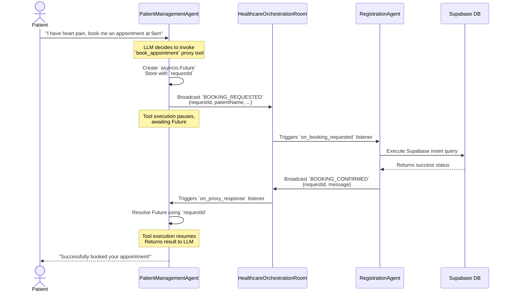

# Patient Orchestration Workflow

This document explains the asynchronous, event-driven multi-agent delegation architecture implemented in M.A.S.H for patient interactions and bookings.

## Architecture Overview

The system strictly decouples **conversational interactions** from **backend operations** by utilizing the Band.ai SDK's `Room` network.

- **Patient Management Agent (The Brain)**: Holds the LLM (`gemini-1.5-flash`), processes natural language, and acts as the front-line interface for the patient. It does *not* interact directly with the database.
- **Registration Agent (The Doer)**: Operates purely in the background. It lacks an LLM and instead runs a StateGraph that listens for backend task requests. It communicates directly with the Supabase database.
- **Healthcare Orchestration Room**: The P2P event bus that facilitates communication between the agents.

## Sequence Diagram

The following diagram illustrates the lifecycle of a patient requesting an appointment booking.

## How It Works in Code

### 1. Proxy Tools in Patient Management Agent
Instead of giving the LLM standard synchronous tools, we give it "proxy tools". When the LLM calls `get_doctors` or `book_appointment`, the tool does the following:
1. Creates an `asyncio.Future` and attaches a UUID (`requestId`).
2. Broadcasts the request payload to the `HealthcareOrchestrationRoom`.
3. Calls `await asyncio.wait_for(future)` to pause the LLM's tool execution thread without blocking the whole asyncio loop.

### 2. Execution in Registration Agent
The `RegistrationAgent` constantly listens for events like `QUERY_DOCTORS`, `BOOKING_REQUESTED`, and `RESCHEDULE_REQUESTED`. 
Upon receiving one, it extracts the payload, executes the physical database query in Supabase, and forms a response payload containing the original `requestId`. It then broadcasts this response back to the room.

### 3. Resolving the Future
The `PatientManagementAgent` listens for response events (`DOCTORS_LIST_RESPONSE`, `BOOKING_CONFIRMED`, etc.).
When it hears a response, it pulls the `requestId` from the payload, looks up the waiting `Future` in its `PENDING_REQUESTS` dictionary, and calls `future.set_result(payload)`. 

This instantly resumes the proxy tool, which hands the data back to the LLM, allowing the LLM to formulate its final reply to the patient.

## Advantages of this Pattern
- **Separation of Concerns**: The LLM agent is cleanly separated from the database agent.
- **Scalability**: If the clinic gets busier, we can spin up multiple `RegistrationAgent` instances to handle the database load without modifying the `PatientManagementAgent`.
- **Fault Tolerance**: If the `RegistrationAgent` crashes, the `asyncio.wait_for` in the proxy tool will simply timeout after 10 seconds, and the LLM can gracefully tell the patient that the system is currently down, rather than hard-crashing.
