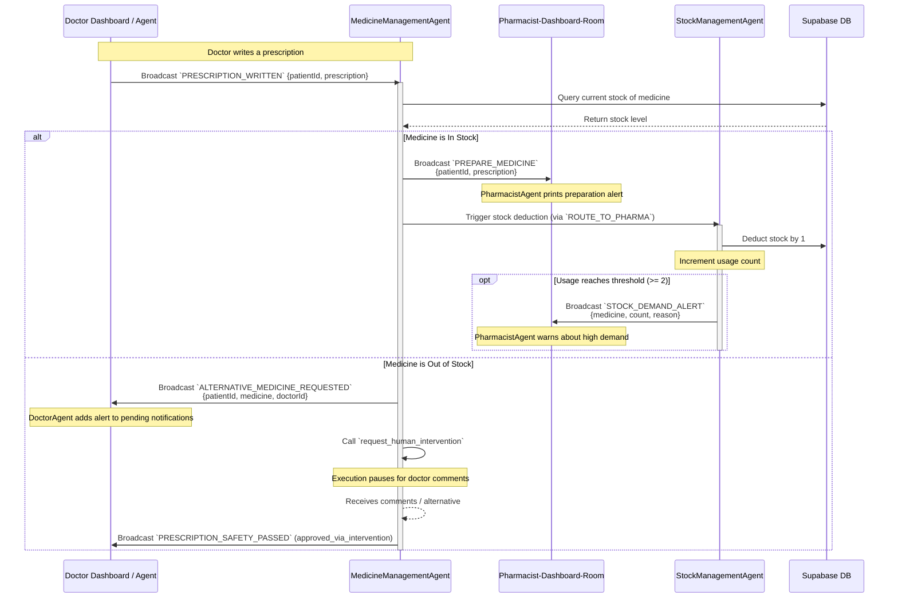

# Prescription Check & Pharmacy Routing Workflow

This document explains the workflow for validating prescription orders, checking inventory, routing fulfilled requests to the pharmacy, handling out-of-stock exceptions via human-in-the-loop validation, and raising automated stock reorder alerts.

## Overview

When a doctor writes a prescription:
1. The **Medicine/Prescription Management Agent** intercept it and queries Supabase to verify stock levels.
2. **In Stock (Yes)**: The order is dispatched to the **Pharmacist Dashboard Room** to alert the pharmacist, and stock counts are deducted.
3. **Out of Stock (No)**: The agent issues an alert to the **Doctor Dashboard Room** and pauses for human-in-the-loop approval, requesting alternative drug comments from the physician.
4. Concurrently, the **Stock Management Agent** tracks usage counts. If a medicine's frequency exceeds a threshold, it issues a demand alert suggesting the pharmacist prepare extra stock.

## Rooms and Agents Involved

- **Pharmacy-Inventory-Room**: Coordinates inventory updates and stock reorder triggers.
- **Pharmacist-Dashboard-Room**: Private workspace channel for the pharmacist.
- **Doctor-Dashboard-Room**: Alerts doctor agents about out-of-stock medications.
- **MedicineManagementAgent**: Audits stock levels and manages human-in-the-loop intervention.
- **StockManagementAgent**: Tracks usage rates, updates databases, and triggers reorders.
- **PharmacistAgent**: Processes order preps and rising demand suggestions in the pharmacist room.

## Detailed Event Sequence



## Inventory Threshold Rules

- **Low Stock Threshold**: Automatically updated on the dashboard if `current_stock <= reorder_threshold`.
- **High Demand Threshold**: If a drug is prescribed **2 or more times** during a shift (`REORDER_THRESHOLD = 2` inside `StockManagementAgent`), the agent flags it as a high-demand item and broadcasts a reorder suggestion to prepare extra stock.

## Key Events Schema

### `PREPARE_MEDICINE` (Outgoing)
Notifies the pharmacist to package the medication:
```json
{
  "patientId": "c4d32a10-891d-4bf8-a1b1-e2348df8e980",
  "prescription": {
    "medicine": "Amoxicillin 500mg Capsule",
    "dosage": "500mg",
    "frequency": "Three times daily",
    "duration": 7
  }
}
```

### `STOCK_DEMAND_ALERT` (Outgoing)
Sent by the Stock Management Agent when usage rates spike:
```json
{
  "medicine": "Amoxicillin 500mg Capsule",
  "currentUsage": 3,
  "reason": "Demand Alert: Rise in demand for 'Amoxicillin 500mg Capsule' (3 prescriptions requested recently). Suggest preparing extra stock."
}
```
