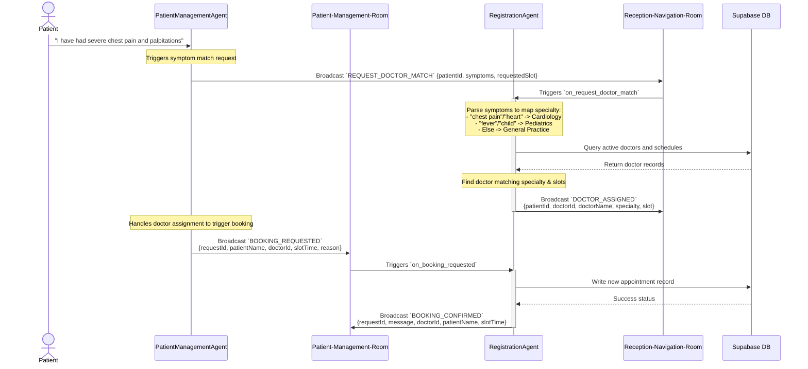

# Symptom Triage & Clinician Matching Workflow

This document describes the event-driven workflow for symptom parsing, triage classification, and clinical matching inside the M.A.S.H ecosystem.

## Overview

When a new patient registers or describes their symptoms via the patient-facing mobile application, the **Registration Agent** coordinates the triage mapping process asynchronously in the background. It maps natural language symptom lists to specialized clinical domains, checks matching doctor availability in the database, and schedules the appointment.

## Rooms and Agents Involved

- **Patient-Management-Room**: Serves as the channel for processing doctor queries, check-in statuses, and scheduling slot validations.
- **Reception-Navigation-Room**: Serves as the front-desk channel for routing patients and assigning staff.
- **RegistrationAgent**: Runs a LangGraph state graph in the background to handle symptom matching and schedule database operations in Supabase.

## Detailed Event Sequence



## Symptom Classification Rules

The Registration Agent parses symptoms in a rule-based triage node inside its `LangGraph` pipeline:

| Keywords | Target Specialty |
| :--- | :--- |
| `"chest pain"`, `"heart"`, `"cardio"` | **Cardiology** |
| `"fever"`, `"child"`, `"pediatric"` | **Pediatrics** |
| *All other inputs* | **General Practice** |

## Key Events Schema

### `REQUEST_DOCTOR_MATCH` (Incoming)
Sent by the client interface or triage coordinator to request matching:
```json
{
  "patientId": "3b29c9df-4aa1-4da2-9b2f-3b7c8df81512",
  "symptoms": "chest pain and shortness of breath",
  "requestedSlot": "10:30 AM"
}
```

### `DOCTOR_ASSIGNED` (Outgoing)
Broadcast to the `Reception-Navigation-Room` to communicate triage match outcome:
```json
{
  "patientId": "3b29c9df-4aa1-4da2-9b2f-3b7c8df81512",
  "doctorId": "a6bb7c5b-ef00-4ea7-8b01-b66b8df815bd",
  "doctorName": "Dr. Desai",
  "specialty": "Cardiology",
  "slot": "10:30 AM"
}
```
