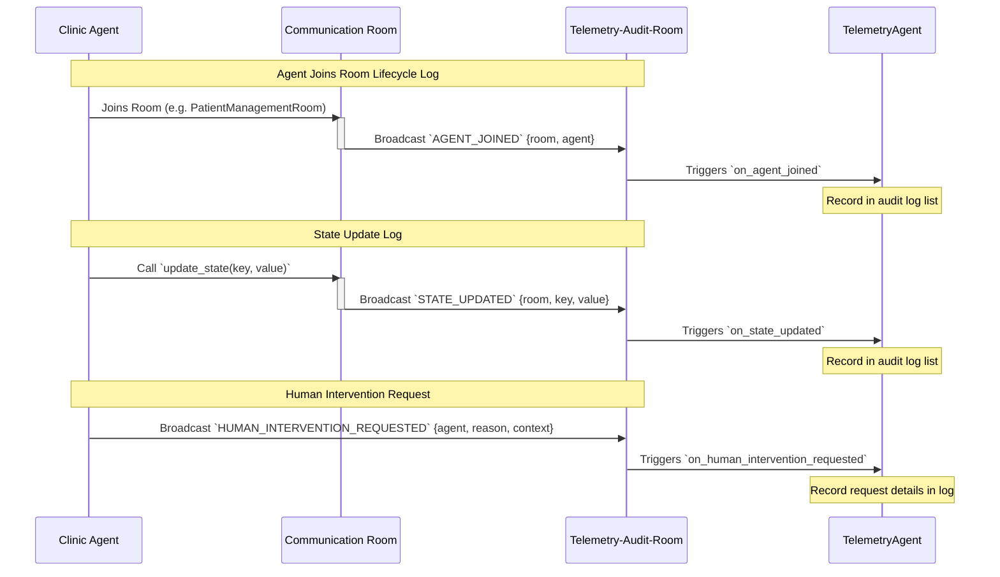

# Telemetry & System Audit Logging Workflow

This document explains the telemetry collection and central audit logging workflow, showing how all multi-agent activities, state updates, and human interventions are tracked across the clinic ecosystem.

## Overview

To ensure clinical auditability, security, and traceability:
1. Every agent automatically tracks its own events locally via a static `Telemetry` tracker.
2. In addition, room-level activity (such as agents joining a room, updating a state, or requesting a human-in-the-loop validation) is broadcasted to the **Telemetry-Audit-Room**.
3. The **Telemetry Agent** subscribes to this room, aggregates the entries sequentially in an internal state graph log, and prints a compiled `Clinic Audit Report` upon system shutdown or audit query.

## Rooms and Agents Involved

- **Telemetry-Audit-Room**: A secure, read-only room where all agents and rooms relay lifecycle logs, state updates, and intervention requests.
- **TelemetryAgent**: Listens to the audit room, builds a linear timeline log, and formats audit reports.
- **All Agents**: Broadcast their joining events, state changes, and intervention details to the audit room.

## Detailed Event Sequence



## Audit Report Format

When `generate_audit_report()` is called, the Telemetry Agent parses its sequential log list and outputs a structured CLI report:

```text
=== CLINIC AUDIT REPORT ===
01. [JOIN] Agent 'StockManagementAgent' joined room 'Pharmacist-Dashboard-Room'
02. [STATE] Room 'Pharmacy-Inventory-Room': key 'stock_Amoxicillin' updated to '14'
03. [INTERVENTION REQUEST] Agent 'MedicineManagementAgent' requested approval: Medicine 'rare-penicillin' is out of stock. Alternate prescription required.
04. [INTERVENTION RESOLUTION] Agent 'MedicineManagementAgent' intervention resolved: approved - Comments: Doctor reviewed and approved.
```

## Key Events Schema

### `AGENT_JOINED` (Incoming)
Reports an agent entering a room:
```json
{
  "room": "Doctor-Dashboard-Room",
  "agent": "SummaryAgent"
}
```

### `STATE_UPDATED` (Incoming)
Reports a shared room state modification:
```json
{
  "room": "Pharmacy-Inventory-Room",
  "key": "inventory_last_checked",
  "value": "2026-06-17T08:50:00Z"
}
```

### `HUMAN_INTERVENTION_REQUESTED` (Incoming)
Reports a human-in-the-loop check request:
```json
{
  "agent": "MedicineManagementAgent",
  "reason": "Medicine 'rare-antibiotic' is out of stock. Alternate prescription required.",
  "context": {
    "patientId": "e1f13b19-c603-49d6-8486-ffc07e05f039",
    "medicine": "rare-antibiotic"
  }
}
```
